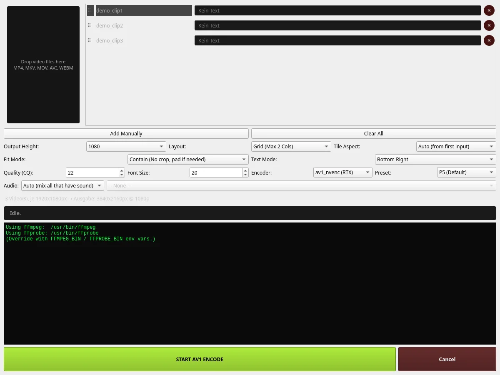

# DaSiWa-simple-rtx-video-assambler


A powerful Qt-based desktop application for creating side-by-side or grid comparisons using NVENC AV1 hardware acceleration via FFmpeg. Build stunning multi-video layouts with precise control over aspect ratios, fit modes, text overlays, and audio mixing.

## ✨ Features

- **Multi-Video Layouts**: Single row, single column, or 2-column grid arrangements
- **Hardware Acceleration**: NVENC AV1 encoding on RTX GPUs for fast processing
- **Flexible Aspect Ratios**: Auto-detect, 16:9, 4:3, 1:1, 9:16, 4:5, and more
- **Fit Modes**: Contain (pad), Cover (crop), or Stretch options
- **Custom Text Overlays**: Per-video text with 6 position options (corners + center)
- **Audio Mixing**: Auto-mix all audio tracks or select specific sources
- **Drag & Drop**: Native drag-and-drop file loading and row reordering
- **Real-time Preview**: Live resolution calculation as you configure
- **Cross-Platform**: Works on Linux, Windows, and macOS

## 📸 Preview



## 🚀 Quick Start

### Prerequisites

1. **Python 3.10+** installed
2. **FFmpeg** in your system PATH (`ffmpeg` command available)
3. **RTX GPU** (optional, for NVENC encoding)

### Installation

```bash
# Clone the repository
git clone https://github.com/darksidewalker/DaSiWa-simple-rtx-video-assambler.git
cd DaSiWa-simple-rtx-video-assambler

# Create and activate virtual environment
python -m venv venv
source venv/bin/activate  # On Windows: venv\Scripts\activate

# Install dependencies
pip install PySide6
```

### Running

```bash
python vid_tool.py
```

Or create a launcher script:

```bash
#!/bin/bash
source venv/bin/activate
python vid_tool.py
```

Make executable: `chmod +x run.sh` then `./run.sh`

## 🛠 How to Use

### 1. Add Videos

**Option A: Drag & Drop**
- Drag `.mp4`, `.mkv`, `.mov`, `.avi`, or `.webm` files into the drop zone or directly onto the video list

**Option B: Manual Selection**
- Click "Add Manually" button to browse and select files

### 2. Reorder Videos

- Click and drag the ⠿ handle next to any video row to reorder
- Videos maintain their custom text when reordered

### 3. Configure Output

#### Output Settings
- **Height**: Select target vertical resolution (720p, 1080p, 1440p, 2160p)
- **Layout**: Choose arrangement mode:
  - Grid (Max 2 Cols) - Side-by-side pairs
  - Single Row - Horizontal strip
  - Single Column - Vertical stack
- **Tile Aspect**: Control individual tile proportions:
  - Auto (probes first input)
  - 16:9, 4:3, 1:1, 9:16, 4:5, or legacy 1376:1760
- **Fit Mode**: Handle aspect ratio mismatches:
  - Contain - Letterbox/pillarbox (default)
  - Cover - Crop to fill
  - Stretch - Distort to fit

#### Encoding Quality
- **Quality (CQ)**: Constant Quality parameter (lower = better quality, larger file)
  - Range: 1-51
  - Recommended: 20-30 for most use cases
- **Font Size**: Text overlay size (10-200px)
- **Encoder**: 
  - av1_nvenc (RTX) - Hardware accelerated, requires NVIDIA GPU
  - libsvtav1 - CPU fallback
- **Preset**: Performance vs quality trade-off
  - NVENC: P1 (fastest) to P9/Quality (slowest/best)
  - SVT-AV1: Speed 8 (fastest) to Speed 1/Quality (slowest/best)

#### Audio Configuration
- **Auto Mix** - Combine audio from all videos
- **None** - Strip all audio
- **From Specific File** - Use audio from one source only

### 4. Add Custom Text

Click on the text field in any video row to add labels:
- Supports up to 50 characters per video
- Text appears at configurable position (Top Left/Center/Right, Bottom Left/Center/Right)
- Extension names automatically stripped from display

### 5. Encode

1. Click **"START AV1 ENCODE"**
2. Monitor progress in the log area
3. Wait for completion (status shows elapsed time)

### 6. Post-Encode Actions

- **Open Folder** - Navigate to output directory (`~/Videos/rve-output/`)
- **Copy Cmd** - Copy full FFmpeg command to clipboard for reference

## 💡 Tips & Notes

### Resolution Preview
The app calculates real-time output dimensions based on:
- Number of videos
- Selected layout (columns)
- Input aspect ratio (first video probed)
- Target height

Example: 3 videos @ 1920x1080 in 2-col grid → 3840x1620 output

### Text Overlay Escaping
Special characters in text are automatically escaped for FFmpeg:
- Backslashes: `\` → `\\`
- Colons: `:` → `\:`
- Quotes: `'` → `\'`
- Commas: `,` → `\,`

### Performance

**NVENC (Recommended)**
- Uses GPU hardware encoder
- Much faster than CPU
- Requires RTX 2000 series or newer
- Best presets: P5-P7 for balanced speed/quality

**libsvtav1 (CPU Fallback)**
- Software encoding
- Slower but works everywhere
- Higher preset numbers = faster
- Best presets: Speed 4-6 for good balance

### File Naming
Output files follow pattern: `assembled_YYYYMMDD_HHMMSS.mp4`
Location: `~/Videos/rve-output/`

### Supported Formats
- **Input**: MP4, MKV, MOV, AVI, WEBM
- **Output**: MP4 (with AV1 codec)

## 🔧 Environment Variables

Override binary paths if needed:

```bash
export FFMPEG_BIN=/path/to/custom/ffmpeg
export FFPROBE_BIN=/path/to/custom/ffprobe
```

## 🐛 Troubleshooting

### "No videos loaded"
Ensure you've added at least one video file. Check extensions match supported formats.

### Encoding fails with exit code > 0
- Check FFmpeg is properly installed and accessible
- Verify input files are valid (test with `ffprobe <file>`)
- Review error logs in the bottom panel
- Try different encoder (NVENC ↔ libsvtav1)

### Slow encoding
- Lower the preset number (higher speed)
- Increase Quality (CQ) value slightly
- Use NVENC if available
- Reduce output resolution

### Text not appearing
- Ensure text field is filled (not empty)
- Check text length doesn't exceed 50 chars
- Verify text mode position isn't off-screen

## 📁 Project Structure

```
├── vid_tool.py              # Main application code
├── requirements.txt         # Python dependencies
├── assets/                  # Preview images and screenshots
│   └── app-preview.webp     # README preview image
├── .venv/                   # Virtual environment
└── README.md                # This file
```

## 🤝 Contributing

Contributions welcome! Areas for improvement:
- Additional aspect ratio presets
- More layout options (3+ columns)
- Batch processing support
- Export/import configurations
- Unit tests

## 📄 License

MIT License - Feel free to use, modify, and distribute.

## 🔗 Links

- [GitHub Repository](https://github.com/darksidewalker/DaSiWa-simple-rtx-video-assambler)
- [FFmpeg Documentation](https://ffmpeg.org/documentation.html)
- [NVIDIA NVENC API](https://developer.nvidia.com/video-codec-sdk)

---

Built with ❤️ using PySide6 and FFmpeg
